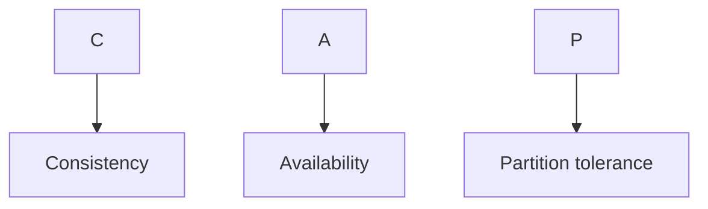
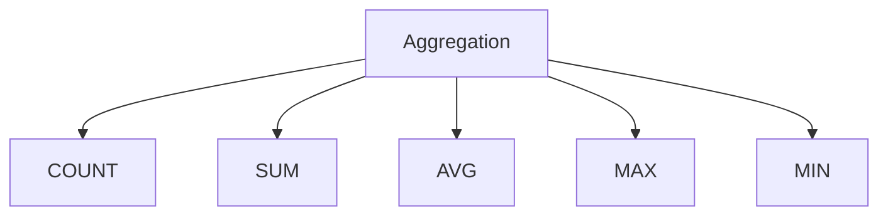

# SQL

## ACID

DBMS is the management of data that should remain integrated when any changes are done in it. It is because if the integrity of the data is affected, whole data will get disturbed and corrupted. Therefore, to maintain the integrity of the data, there are four properties described in the database management system, which are known as the ACID(Atomicity, Consistency, Isolation, Durability) properties. <sup>[[1]](#references)</sup>

* ### Atomicity

    If any operation is performed on the data, either it should be performed or executed completely or should not be executed at all. It means that the operation should not break in between or execute partially. There is no midway i.e. transactions do not occur partially. Atomicity is also known as the 'All or nothing rule'.

    Consider an example, let's suppose I am transferring 1000 from my account to my friend Abdurrab's account. And suppose amount has debitted from my account and amount has not updated to Abdurrab's account due to internet issue. This results in an incosistent database state. Therefore, the transaction must be executed in entirety in order to ensure correctness of database state.

* ### Consistency

    The word consistency means that the value should remain preserved always. In DBMS, the integrity of the data should be maintained, which means if a change in the database is made, it should remain preserved always. In the case of transactions, the integrity of the data is very essential so that the database remains consistent before and after the transaction.

* ### Isolation

    The term 'isolation' means separation. The operation on one database should begin when the operation on the first database gets complete. Transactions occur independently without interference. Changes occurring in a particular transaction will not be visible to any other transaction until that particular change in that transaction has been committed.

    Example: If two operations are concurrently running on two different accounts, then the value of both accounts should not get affected. The value should remain persistent. As you can see in the below diagram, account A is making T1 and T2 transactions to account B and C, but both are executing independently without affecting each other. It is known as Isolation.
    
    <sup>[[2]](#references)</sup>

* ### Durability

    This property ensures that once the transaction has completed execution, the updates and modifications to the database are stored in and written to disk and they persist even if a system failure occurs. These updates now become permanent and are stored in non-volatile memory. The effects of the transaction, thus, are never lost.<sup>[[3]](#references)</sup>

## CAP Theorem

The CAP theorem is a belief from theoretical computer science about distributed data stores that claims, in the event of a network failure on a distributed database, it is possible to provide either consistency, availability or Patition tolerence

CAP theorem says that a distributed system can deliver only two of three(either CA or CP or AP but not CAP) desired characteristics: consistency, availability, and partition tolerance (the ‘C,’ ‘A’ and ‘P’ in CAP).<sup>[[4]](#references)</sup>



* ### Consistency

    Consistency means that all clients see the same data at the same time, no matter which node they connect to. For this to happen, whenever data is written to one node, it must be instantly forwarded or replicated to all the other nodes in the system before the write is deemed ‘successful.’

* ### Availability

    Availability means that any client making a request for data gets a response, even if one or more nodes are down. Another way to state this—all working nodes in the distributed system return a valid response for any request, without exception.

* ### Partition tolerance

    A partition is a communications break within a distributed system—a lost or temporarily delayed connection between two nodes. Partition tolerance means that the cluster must continue to work despite any number of communication breakdowns between nodes in the system.<sup>[[5]](#references)</sup>

### CA

data is consistent between all nodes - as long as all nodes are online - and you can read/write from any node and be sure that the data is the same, but if you ever develop a partition between nodes, the data will be out of sync (and won't re-sync once the partition is resolved).

### CP

data is consistent between all nodes, and maintains partition tolerance (preventing data desync) by becoming unavailable when a node goes down.

### AP

nodes remain online even if they can't communicate with each other and will resync data once the partition is resolved, but you aren't guaranteed that all nodes will have the same data (either during or after the partition)

## Joins<sup>[[6]](#references)</sup>

Join statement is used to combine data or rows from two or more tables based on a common field between them.
There are four types of Joins are as follows: 

* INNER JOIN
* LEFT JOIN
* RIGHT JOIN
* FULL JOIN

* ### INNER JOIN

In SQL, INNER JOIN selects records that have matching values in both tables as long as the condition is satisfied. It returns the combination of all rows from both the tables where the condition satisfies.

<sup>[[7]](#references)</sup>

* #### Syntax

```sql
    SELECT table1.column1, table1.column2, table2.column1,....  
    FROM table1   
    INNER JOIN table2  
    ON table1.matching_column = table2.matching_column; 
```

* ### LEFT JOIN

    This join returns all the rows of the table on the left side of the join and matches rows for the table on the right side of the join. For the rows for which there is no matching row on the right side, the result-set will contain null. LEFT JOIN is also known as LEFT OUTER JOIN.

    <sup>[[8]](#references)</sup>

* #### Syntax

```sql
    SELECT table1.column1, table1.column2, table2.column1,....  
    FROM table1   
    LEFT JOIN table2  
    ON table1.matching_column = table2.matching_column;  
```

* ### RIGHT JOIN

    RIGHT JOIN is similar to LEFT JOIN. This join returns all the rows of the table on the right side of the join and matching rows for the table on the left side of the join. For the rows for which there is no matching row on the left side, the result-set will contain null. RIGHT JOIN is also known as RIGHT OUTER JOIN.

    <sup>[[9]](#references)</sup>

* #### Syntax

```sql
    SELECT table1.column1, table1.column2, table2.column1,....  
    FROM table1   
    RIGHT JOIN table2  
    ON table1.matching_column = table2.matching_column;  
```

* ### FULL JOIN

    FULL JOIN creates the result-set by combining results of both LEFT JOIN and RIGHT JOIN. The result-set will contain all the rows from both tables. For the rows for which there is no matching, the result-set will contain NULL values.

    <sup>[[10]](#references)</sup>

* #### Syntax

```sql
    SELECT table1.column1, table1.column2, table2.column1,....  
    FROM table1   
    FULL JOIN table2  
    ON table1.matching_column = table2.matching_column;  
```

## Aggregations, Filters in queries

SQL aggregation function is used to perform the calculations on multiple rows of a single column of a table. It returns a single value.



* ### COUNT FUNCTION

    COUNT function is used to Count the number of rows in a database table. It can work on both numeric and non-numeric data types.

    COUNT function uses the COUNT(*) that returns the count of all the rows in a specified table.
    COUNT(*) considers duplicate and Null.

* #### Syntax

```sql
    COUNT(*)  
    or  
    COUNT( [ALL|DISTINCT] expression )  
```
 
* ### SUM Function

    Sum function is used to calculate the sum of all selected columns. It works on numeric fields only.

* #### Syntax

```sql
    SUM()  
    or  
    SUM( [ALL|DISTINCT] expression ) 
```

* ### AVG function

    The AVG function is used to calculate the average value of the numeric type. AVG function returns the average of all non-Null values.

* #### Syntax

```sql
    AVG()  
    or  
    AVG( [ALL|DISTINCT] expression )  
```

* ### MAX Function

    MAX function is used to find the maximum value of a certain column. This function determines the largest value of all selected values of a column.

* #### Syntax

```sql
    MAX()  
    or  
    MAX( [ALL|DISTINCT] expression )  
```

* ### MIN Function

    MIN function is used to find the minimum value of a certain column. This function determines the smallest value of all selected values of a column.

* #### Syntax

```sql
    MIN()  
    or  
    MIN( [ALL|DISTINCT] expression )
```

#### FILTER

FILTER is a modifier used on an aggregate function to limit the values used in an aggregation. It is same as like WHERE and HAVE. FILTER differs from WHERE clause in the aspect that, only one WHERE clause can be used at a time in a query,While on the other hand, multiple FILTER clauses can be present in a single query.

```sql
    SELECT COUNT(ID)
    FILTER(WHERE ID!=2),
    AVG(LENGTH(NAME))
    FILTER(WHERE LENGTH(NAME)>4)
    FROM table_name;
```

## Normalization<sup>[[11]](#references)</sup>

### Anomalies

There are different types of anomalies which can occur in referencing and referenced relation:

#### Updation Anomaly

If some particular attribute value has to be updated, then it has to be updated in every tuple consisting of that value, which would be too costly operation as all records have to be first transferred to the main memory, and then again transferred to the secondary memory after updation.


#### Insertion Anomaly

If a tuple is inserted in referencing relation and referencing attribute value is not present in referenced attribute, it will not allow inserting in referencing relation. Suppose in the above table we need to add a student PQR with Student_ID 1004 and we don't know the Subject_name or the Subject_Id the student intends to take. If the fields are mandatory then, the addition of the data to the table will not be possible.

#### Deletion Anomaly

Deletion of some data may lead to loss of some other useful data. For example, Suppose some student details have to be deleted. Now when the required tuple is deleted, the subject name details corresponding to that student record also gets deleted, which might lead to loss of the details of the subject.

### Normalization

Normalization is the process of minimizing redundancy from a relation or set of relations. Redundancy in relation may cause insertion, deletion and updating anomalies. So, it helps to minimize the redundancy in relations. Normal forms are used to eliminate or reduce redundancy in database tables.

#### First Normal Form

A relation is in first normal form if every attribute in that relation is singled valued attribute. If a relation contains a composite or multi-valued attribute, it violates first normal form or relation is in first normal form if it does not contain any composite or multi-valued attribute.

<sup>[[12]](#references)</sup>

As we can see that the above table contains multi-valued attributes, which violates the principle of first normal form and hence must be reduced. There are various methods of doing this:

Method 1: This involves the creation of multiple columns, distributing the values alongside the new attributes. We can distribute the multivalued attributes to new columns by naming them as Mob No 1, Mob No 2, Mob No 3 etc, depending on the number of multivalued attributes till the table gets reduced to single-valued attribute.

<sup>[[13]](#references)</sup>

But this method got few problems like various fields are needed to be left blank, resulting in wastage of space.

Method 2: This method involves the creation of multiple instead of columns, with copying up of the non-repeated attribute values for each repeated attribute values.

<sup>[[14]](#references)</sup>

In this table we have made a copy of the values of the repeated attributes, keeping other attributes the same. This saves our space but introduces another problem of repetition of Customer_ID, which must remain unique.

Method 3: This method involves the creation of another table and shifting the repeated attributes to that table and linking it with the previous table by using any type of ID.

<sup>[[15]](#references)</sup>

#### Second Normal Form

To be in second normal form, a relation must be in first normal form and relation must not contain any partial dependency. A relation is in 2NF if it has No Partial Dependency, i.e., no non-prime attribute (attributes which are not part of any candidate key) is dependent on any proper subset of any candidate key of the table.
i.e,

* It should be in 1NF

* Any non-prime attribut should not be defined by partial prime attribute.

<sup>[[16]](#references)</sup>

In the above table, the candidate key is the combination of (User_ID, Course_ID) . The non-prime attribute is Course_Fee. Since this non-prime attribute depends partially on the candidate key, this table is not in 2NF.
To convert this into 2NF, one needs to split the table into two and creating a common link between two. As we have done with the above table after splitting them into two and keeping Course_ID as the common key.

<sup>[[17]](#references)</sup>


#### Third Normal Form

It follows two rules:

* The table must be in 2NF.

* Non-prime attribute should not define another non-prime attribute.

#### BCNF

BCNF(Boyce Codd Normal Form) in DBMS is an advanced version of 3NF (third normal form). A table or a relation is said to be in BCNF in DBMS if the table or the relation is already in 3NF, and any prime or non-prime attribute should not define prime attribute..
<sup>[[18]](#references)</sup>

## Indexes in Database

Indexing is a way to optimize the performance of a database by minimizing the number of disk accesses required when a query is processed. It is a data structure technique which is used to quickly locate and access the data in a database.

Indexes are created using a few database columns.

The first column is the Search key that contains a copy of the primary key or candidate key of the table. These values are stored in sorted order so that the corresponding data can be accessed quickly. (The data may or may not be stored in sorted order.)

The second column is the Data Reference or Pointer which contains a set of pointers holding the address of the disk block where that particular key value can be found.<sup>[[19]](#references)</sup>

Indexing can be of the following types −<sup>[[20]](#references)</sup>

### Primary Index

Primary index is defined on an ordered data file. The data file is ordered on a key field. The key field is generally the primary key of the relation.

### Secondary Index

Secondary index may be generated from a field which is a candidate key and has a unique value in every record, or a non-key with duplicate values.

### Clustering Index

Clustering index is defined on an ordered data file. The data file is ordered on a non-key field.

Ordered Indexing is of two types −

* Dense Index
* Sparse Index

#### Dense Index

In dense index, there is an index record for every search key value in the database. This makes searching faster but requires more space to store index records itself. Index records contain search key value and a pointer to the actual record on the disk.

#### Sparse Index

In sparse index, index records are not created for every search key. An index record here contains a search key and an actual pointer to the data on the disk. To search a record, we first proceed by index record and reach at the actual location of the data. If the data we are looking for is not where we directly reach by following the index, then the system starts sequential search until the desired data is found.

### Multilevel Index

Index records comprise search-key values and data pointers. Multilevel index is stored on the disk along with the actual database files. As the size of the database grows, so does the size of the indices. There is an immense need to keep the index records in the main memory so as to speed up the search operations. If single-level index is used, then a large size index cannot be kept in memory which leads to multiple disk accesses.

Multi-level Index helps in breaking down the index into several smaller indices in order to make the outermost level so small that it can be saved in a single disk block, which can easily be accommodated anywhere in the main memory

## Transactions<sup>[[21]](#references)</sup>

A transaction can be defined as a group of tasks. A single task is the minimum processing unit which cannot be divided further. A transaction is a very small unit of a program and it may contain several lowlevel tasks. A transaction in a database system must maintain Atomicity, Consistency, Isolation, and Durability (ACID) properties.

### Serializability

When multiple transactions are being executed by the operating system in a multiprogramming environment, there are possibilities that instructions of one transactions are interleaved with some other transaction.

#### Schedule

A chronological execution sequence of a transaction is called a schedule. A schedule can have many transactions in it, each comprising of a number of instructions/tasks.

#### Serial Schedule

It is a schedule in which transactions are aligned in such a way that one transaction is executed first. When the first transaction completes its cycle, then the next transaction is executed. Transactions are ordered one after the other. This type of schedule is called a serial schedule, as transactions are executed in a serial manner.

### States of Transactions

A transaction in a database can be in one of the following states −

<sup>[[22]](#references)</sup>

* #### Active

    In this state, the transaction is being executed. This is the initial state of every transaction.

* #### Partially Committed

    When a transaction executes its final operation, it is said to be in a partially committed state.

* #### Failed

    A transaction is said to be in a failed state if any of the checks made by the database recovery system fails. A failed transaction can no longer proceed further.

* #### Aborted

    If any of the checks fails and the transaction has reached a failed state, then the recovery manager rolls back all its write operations on the database to bring the database back to its original state where it was prior to the execution of the transaction. Transactions in this state are called aborted. The database recovery module can select one of the two operations after a transaction aborts −

    * Re-start the transaction
    * Kill the transaction
    
* #### Committed

    If a transaction executes all its operations successfully, it is said to be committed. All its effects are now permanently established on the database system.

## Locking mechanism

Locking protocols are used in database management systems as a means of concurrency control. Multiple transactions may request a lock on a data item simultaneously. Hence, we require a mechanism to manage the locking requests made by transactions. Such a mechanism is called as Lock Manager.<sup>[[23]](#references)</sup>

### Lock-based Protocols<sup>[[24]](#references)</sup>

A lock is a variable associated with a data item that describes the status of the data item with respect to a possible operation that can be applied to it. They synchronize the access by concurrent transactions to the database items. It is required in this protocol that all the data items must be accessed in a mutually exclusive manner.

The two common locks which are used and some terminology followed in this protocol.

* #### Shared Lock (S)

    It is also known as Read-only lock. As the name suggests it can be shared between transactions because while holding this lock the transaction does not have the permission to update data on the data item. S-lock is requested using lock-S instruction.

* #### Exclusive Lock (X)

    In this lock, the data items can be both read and written. This is Exclusive and cannot be held simultaneously on the same data item. X-lock is requested using lock-X instruction.

* #### Simplistic Lock Protocol

    This is sort of a pre-lock for the objects which is generally obtained before the beginning of any operation. Once the write operation has been performed, the data may be unlocked by the transaction.

* #### Pre-claiming Locking

    This locking mechanism is used during the execution process for the evaluation of operations and the creation of a list of initiating data items. Everything is unlocked once all the operations are over.

#### Starvation

It is possible if the concurrency control manager is badly designed. For example, A transaction may be waiting for an X-lock on an item, while a sequence of other transactions requests and are granted an S-lock on the same item. This may be avoided if the concurrency control manager is properly designed.

#### Deadlock

This is the situation when multiple processes are waiting for each other to complete and release a resource. It leads to a circular chain of a wait when neither of them is able to complete as one hold the resource of completion of another.

### Two-phase Locking Protocol or 2PL

A transaction is said to follow a Two-Phase Locking protocol if Locking and Unlocking can be done in two phases.

* #### Growing Phase

    New locks on data items may be acquired but none can be released. Shrinking Phase: Existing locks may be released but no new locks can be acquired.

Although the protocol offers serializability, it doesn't avoid the deadlock situation. This is further divided into four types:

* #### Strict 2PL

    This method does not release the lock after every usage. It holds the lock until the whole process is over and releases the lock at one go.

* #### Centralized 2PL

    This mechanism has a single lock manager for the management of the entire process.

* #### Primary copy 2PL

    In this type, various copies of a single primary 2PL are distributed to various sites but the data items are controlled by a single primary 2PL. Once the main copy has been updated, the change is reflected on all the associated copies.

* #### Distributed 2PL

    In this type, all the sites are provided with the lock managers to manage the locks of the data of those sites. It resembles primary 2PL when no changes take place in the lock managers and also the communication cost of the former is more than the latter.

### Timestamp-based Protocols

A timestamp is a unique identifier created by the DBMS to identify a transaction. They are usually assigned in the order in which they are submitted to the system, so a timestamp may be thought of as the transaction start time. There may be different ways of generating timestamps such as:

* A simple counter that increments each time its value is assigned to a transaction. They may be numbered 1, 2, 3….

The main idea for this protocol is to order the transactions based on their Timestamps. The advantages of using Timestamp-based protocols are:

* A schedule in which the transactions participate is then serializable and the only equivalent serial schedule permitted has the transactions in the order of their Timestamp Values.

* The deadlocks can be avoided since there is no waiting time for the transaction.

One disadvantage of such a mechanism is that it might lead to starvation if the same transaction is continuously aborted and restarted.

## Database Isolation Levels

Standard SQL defines four database isolation levels that can be set using the SET TRANSACTION ISOLATION LEVEL statement: Serializable, Repeatable Read, Read Committed, and Read Uncommitted<sup>[[25]](#references)</sup>

### Read Uncommitted<sup>[[26]](#references)</sup>

Read Uncommitted is the lowest isolation level. In this level, one transaction may read not yet committed changes made by other transactions, thereby allowing dirty reads. At this level, transactions are not isolated from each other.

### Read Committed

This isolation level guarantees that any data read is committed at the moment it is read. Thus it does not allow dirty read. The transaction holds a read or write lock on the current row, and thus prevents other transactions from reading, updating, or deleting it.

### Repeatable Read

This is the most restrictive isolation level. The transaction holds read locks on all rows it references and writes locks on referenced rows for update and delete actions. Since other transactions cannot read, update or delete these rows, consequently it avoids non-repeatable read.

### Serializable

This is the highest isolation level. A serializable execution is guaranteed to be serializable. Serializable execution is defined to be an execution of operations in which concurrently executing transactions appears to be serially executing.

## Triggers

Trigger: A trigger is a stored procedure in database which automatically invokes whenever a special event in the database occurs. For example, a trigger can be invoked when a row is inserted into a specified table or when certain table columns are being updated

#### Syntax:

```SQL
    create trigger [trigger_name]
    [before | after]
    {insert | update | delete}
    on [table_name]
    [for each row]
    [trigger_body]
```

#### Explanation of syntax:

* create trigger [trigger_name]:Creates or replaces an existing trigger with the trigger_name.

* [before | after]: This specifies when the trigger will be executed.

* {insert | update | delete}: This specifies the DML operation.

* on [table_name]: This specifies the name of the table associated with the trigger.

* [for each row]: This specifies a row-level trigger, i.e., the trigger will be executed for each row being affected.

* [trigger_body]: This provides the operation to be performed as trigger is fired<sup>[[27]](#references)</sup>

BEFORE and AFTER of Trigger:

BEFORE triggers run the trigger action before the triggering statement is run. AFTER triggers run the trigger action after the triggering statement is run.

Triggers are written to be executed in response to any of the following events −

* A database manipulation (DML) statement (DELETE, INSERT, or UPDATE)

* A database definition (DDL) statement (CREATE, ALTER, or DROP).

* A database operation (SERVERERROR, LOGON, LOGOFF, STARTUP, or SHUTDOWN).

Triggers can be defined on the table, view, schema, or database with which the event is associated.

#### Benefits of Triggers

Triggers can be written for the following purposes −

* Generating some derived column values automatically
* Enforcing referential integrity
* Event logging and storing information on table access
* Auditing
* Synchronous replication of tables
* Imposing security authorizations
* Preventing invalid transactions<sup>[[28]](#references)</sup>


## References

1. https://www.javatpoint.com/acid-properties-in-dbms'

2. https://static.javatpoint.com/dbms/images/acid-properties-in-dbms5.png

3. https://www.geeksforgeeks.org/acid-properties-in-dbms/

4. https://www.google.com/url?sa=t&rct=j&q=&esrc=s&source=web&cd=&cad=rja&uact=8&ved=2ahUKEwi6ovXS29f7AhVZ4TgGHZPKBL8QFnoECBEQAw&url=https%3A%2F%2Fwww.bmc.com%2Fblogs%2Fcap-theorem%2F&usg=AOvVaw2R6EVOwQa-1ri89DuTrYh6

5. https://www.ibm.com/in-en/cloud/learn/cap-theorem

6. https://www.javatpoint.com/dbms-sql-joins

7. https://blog.codinghorror.com/content/images/uploads/2007/10/6a0120a85dcdae970b012877702708970c-pi.png

8. https://i.stack.imgur.com/VkAT5.png

9. https://media.geeksforgeeks.org/wp-content/uploads/20220515095048/join.jpg

10. https://i.stack.imgur.com/3Ll1h.png

11. https://practice.geeksforgeeks.org/batch/cip-da-1/track/placement100-dbms/article/MjQ3Ng%3D%3D

12. https://media.geeksforgeeks.org/wp-content/cdn-uploads/20190918123749/nf1.png

13. https://media.geeksforgeeks.org/wp-content/cdn-uploads/20190918125000/nf2.png

14. https://media.geeksforgeeks.org/wp-content/cdn-uploads/20190918125514/nf3.png

15. https://media.geeksforgeeks.org/wp-content/cdn-uploads/20190918132643/nf4.png

16. https://media.geeksforgeeks.org/wp-content/cdn-uploads/20190918134147/nf5.png

17. https://media.geeksforgeeks.org/wp-content/cdn-uploads/20190918135453/nf6.png

18. https://www.google.com/url?sa=t&rct=j&q=&esrc=s&source=web&cd=&cad=rja&uact=8&ved=2ahUKEwiu6LPL99j7AhULe94KHdlIB2QQFnoECBEQAw&url=https%3A%2F%2Fwww.scaler.com%2Ftopics%2Fbcnf-in-dbms%2F&usg=AOvVaw1psrAbpHAC2baEE9Xn4MCt

19. https://practice.geeksforgeeks.org/batch/cip-da-1/track/placement100-dbms/article/MjcxOQ%3D%3D

20. https://www.tutorialspoint.com/dbms/dbms_indexing.htm#

21. https://www.tutorialspoint.com/dbms/dbms_transaction.htm

22. https://www.tutorialspoint.com/dbms/images/transaction_states.png

23. https://www.geeksforgeeks.org/implementation-of-locking-in-dbms/

24. https://practice.geeksforgeeks.org/batch/cip-da-1/track/placement100-dbms/article/MjY1OQ%3D%3D

25. https://www.google.com/url?sa=t&rct=j&q=&esrc=s&source=web&cd=&cad=rja&uact=8&ved=2ahUKEwjYjO-Pjtn7AhWs2TgGHc0RAZsQFnoECDQQAw&url=https%3A%2F%2Fwww.dbta.com%2FEditorial%2FThink-About-It%2FUnderstanding-Database-Isolation-Levels-151764.aspx&usg=AOvVaw0oaI6P8ysxswj_c1OTDMXh

26. https://www.geeksforgeeks.org/transaction-isolation-levels-dbms/

27. https://www.geeksforgeeks.org/sql-trigger-student-database/

28. https://www.tutorialspoint.com/plsql/plsql_triggers.htm